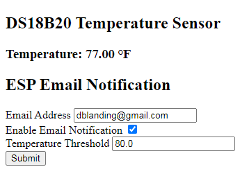
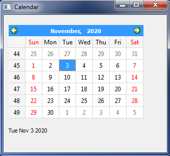
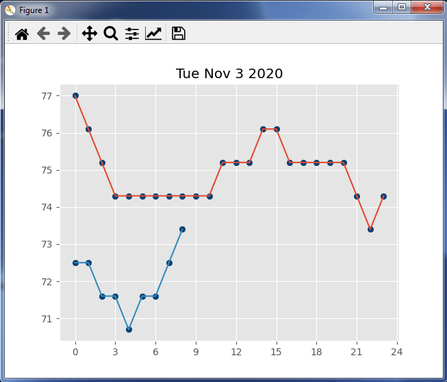

## ESP32 Project: temp-log-alert-display

This project started out as an **ESP32 project: over_temp_email_alert**
following a [Random Nerd Tutorial](https://RandomNerdTutorials.com/esp32-email-alert-temperature-threshold/). The project works very well.  It has a nice web interface (shown below) which displays not only the current temperature, but also allows convenient modification of  some of the **_email notification_** parameters.  This sure beats having to upload new firmware just to make a small adjustment in temperature threshold, for example.
### ESP32 Web Interface
>

### Data Collection and Archiving
I have a Raspberry Pi on my LAN running the Python program **collect_data.py**, which
* collects temperature readings from the ESP32 six times per hr
* writes out collected time, temperature data into a .csv file daily
* saves the files into a folder structure which is created on the fly (as below).

* year2020/
 * month9/
   * day20.csv
  
The Raspberry Pi computer is also set up as a samba server, so by putting the temperature data inside the /share folder,  it can be accessed by any computer on the LAN.
### Data Display
On my laptop, I can launch the program **temp_by_date.py** which presents a pyqt5 calendar widget.

By clicking on a date in the calendar, a plot of the temperatures for that date is displayed.  
The plot below was generated by clicking twice, first on Nov 2, then on Nov 3. The temperatures for both days are plotted together in two colors.

### Summary
To clarify the architectural configuration of this project, it is distributed over 3 separate devices on my LAN:
* The ESP32 device, which measures the temperature (and sends me an email alert in case of an over temperature condition)
* A Raspberry Pi computer which collects temperature data from the ESP32 (n times per hour) and saves it daily to a file in a folder accesible on the LAN
* My laptop computer, on which I can run the program **temp_by_date.py** to display the temps for any date selected, simply by clicking on the calendar date of interest.
